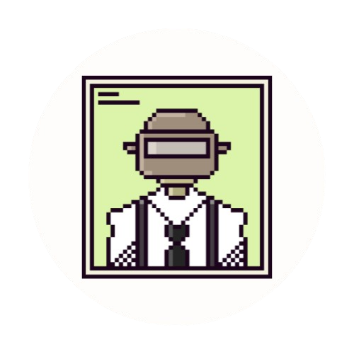

  

<h1 align="center">Creatures of Habit -- Dev Blog</h1>

  <em>"You may seek, but fear the truth behind the truth..."</em>

 

  
  
  

---

Welcome to the official dev blog for **Creatures of Habit** 

#### 🎮 What is *Creatures of Habit*?

**Creatures of Habit** is is a psychological horror experience set in a shifting, sentient hospital.

- 🧱 **Dungeon-Crawling**  
- 🧠 **Immersive Sim Systems**  
- 🧭 **Metroidvania Exploration**

Set in the mysterious **Robin Lake Memorial**, players must unravel shifting realities, survive procedural horrors, and decode esoteric rules to escape… if escape is even possible. 🔐⛓️

**Narrative Premise:** You find yourself exploring Robin Lake Memorial Hospital. After a short but decisive appraisal of the grounds, you make attempt at retracing your steps only to find that the halls have shifted… The walls have you now. After coming to terms with this new reality, you adopt a new purpose: prevent anyone else from being drawn in.

You may seek, but fear the truth behind the truth.

Subtle signs of life begin to appear—others from before, perhaps, or foreboding echoes of what you are becoming. The hospital itself pulses with life, as if moving to the rhythm of a beating heart. Halls and rooms reshape constantly, defying logic and reason. Surrender to the unseen forces that govern this place, for it’s the only way to survive the horrors among you.

**Themes:**

- Exploring different relationships with **isolation** and **disempowerment**
- Examining the compulsive nature of **ritualistic behavior**
- Reckoning with the limits of **understanding, perception** in the face of the unknown

---

## 👩‍💻 About the Team
- 🧰 [Charles Partous](https://charlespartous.com)
- 🧠 [Meghana Bhange](https://meghanabhange.com)

---

## ✍️ What You'll Find Here

- 🚧 Weekly Dev Logs  
- 🧪 Systems Breakdowns  
- 🎨 Design Diaries  
- 🐍 Code Snippets & Prototypes  
- 🔍 Postmortems and Playtest Recaps  
- 💭 Thoughts on horror, ritual, memory & more...

---

## 🔮 Current Development Focus

- 🕹️ **Early playable prototype** (ETA: June/July 2025)  
- 🚀 **Early Access build** for **Steam** and **itch.io** (August 2025)  
- 📝 Weekly dev blog updates on tech, design, and narrative progress  
- 🤝 Open-sourcing small tools & systems as we go

---

> 🕯️ _This blog is a ritual. We write to remember, we share to survive._  
> **Welcome to Robin Lake. We hope you never leave.**
