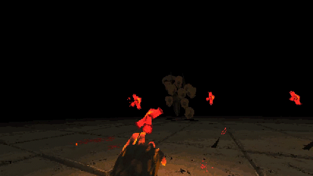

# Visual Identity
::: {.grid}
::: {.g-col-6}
An early inspiration our project's visual style is the indie title *Devil Daggers* by *Sorath*! I am particularly impressed with how well it evokes retro style shooters without sacrificing graphical fidelity or becoming visually obtrusive. Here are some of the techniques used by *Sorath* that we would like to recreate for *Creatures of Habit*...
:::

::: {.g-col-6}


:::
:::
## Unfiltered Textures
*Devil Daggers* makes heavy use of unfiltered textures to get it's sharp and pixelated look. There are two ways to achieve this in Godot...

### Globally 
You can force textures to be filtered by nearest mipmaps by default by setting the option in the **project settings**

(**Rendering → Quality → Filters → Use Nearest Mipmap Filter**)

### Per-Material
In the Godot editor, select a ```StandardMaterial3D``` and find the Sampling section. There you’ll see Filter (texture sampling mode), Repeat (tiling), Anisotropy, Mipmaps toggle, etc. By default it’s “Linear with Mipmaps”, but you can choose “Nearest”.

::: {.grid}
::: {.g-col-6}
If you're using a ```ShaderMaterial```, set the filtering method for your textures using the ```filter_nearest``` hint.
:::

::: {.g-col-6}
```glsl
shader_type spatial;

uniform sampler2D texture_albedo : source_color, filter_nearest, repeat_enable;

void fragment(){
    vec4 albedo = texture(texture_albedo,UV);
    ALBEDO.rgb;
}

```
:::
:::
## High Contrast
One way to influence the overall look of a scene in Godot is by using an ```Environment``` node to set the ```Tonemap``` property. For our purposes, we're opting to go with **ACES** for the high color contrast.

# Player Controller
When I first began this project, I implemented a very simple first-person character controller without adopting any specific architecture. As it turn's out, this was great learning experience in code design as adding more and more features grew to become an incredibly tedious task.

After scrapping the nightmare spaghetti code that was my first character controller, my first step was to outline some objectives. Taking inspiration from Source games I want my character controller to be able to...

- **Walk**
- **Sprint**
- **Jump**
- **Air Strafe**
- **Crouch**

## State Machines
A popular solution for implementing Character controller is to use a **State Machine** to define every possible state that player can be in. This allows programers to define clear behavior for each possible state in relatively straightforward and maintainable way. I however decided against going with a pure state machine approach for the following reasons...

- **You can only be in one state at a time**, meaning that a player could not say *crouch-jump* or be in any other compound state without this state being explicitly defined.

- **You need to define every possible state EXHAUSTIVELY**, meaning that we would need to account for a half a dozen states or more, not even taking into account all compound states as mentioned above.

- **Accounting for all state transitions** becomes less and less manageable as the number of states grows given that every state may or may not need to be able to transition to every other state.

## Our Approach
To resolve these issues, I decided to implement a hybrid **State** and **State Flags** solution! State flags in this context are simply bit flags that represent non-exclusive player behaviors or actions. 

With this approach, we can more easily account for compound states while still adhering to a common architecture. 

The key way for deciding if a particular behavior should be a state or a flag was by figuring our if a player would ever need to or be able to be in any other state while performing said behavior.

::: {.grid}
::: {.g-col-6}
### States
- **GROUNDED**: The player is on the floor, either walking or idle
- **SPRINTING**: The player is on the floor, moving forward, and sprinting
- **JUMPING**: The player is not on the floor and is going upwards
- **FALLING**: The player is not on the floor and is going downwards
:::

::: {.g-col-6}
### State Flags
- **CROUCHING**: The player can crouch while in any state except for sprinting.
- **STRAFING**: The player is moving horizontally in any direction
:::
:::

## Additional Features
### Fall Gravity Scaling
Player character's in games can sometime feel sluggish or *floaty* when jumping, especially if little care is put towards tuning air movement. To help avoid this issue for CoH, I made it so gravity is actually higher as the player falls towards the ground. Done this way, the player will spend more time in the air jumping rather than falling, hopefully improving the visceral feeling on controlling the character.

### Jump Buffering
One way to make player inputs feel more responsive is to *buffer* their inputs. I decided to implement some input buffering for the jump action. Player's should now be able to execute the jump action 0.2 seconds before actually touching the ground, resulting in a jump as soon as contact is made with the floor.

# Interaction System
As interacting directly with the world and objects within it is key to the immersive experience, I thought it would be very important to begin implementation on an **interaction system** early in development.

After doing some research, I found a very elegant implementation by game developer and content creator [Queble](https://www.youtube.com/@queblegamedevelopment4143) on the subject. Specifically his [video](https://www.youtube.com/watch?v=pQINWFKc9_k) on how to make intractable objects in Godot served as a great baseline for my own interaction system.

Setting aside the obvious differences between a 2D and 3D implementations, I opted to use a ```signal``` instead of a ```Callable``` variable for the ```Interactable``` objects. I did so because at this stage in development, using a ```signal``` to communicate when an ```Interactable``` object is triggered felt more versatile. This approach also allows any one instance of ```Interactable``` to be tied to any number of method calls simultaneously instead of only one method.  